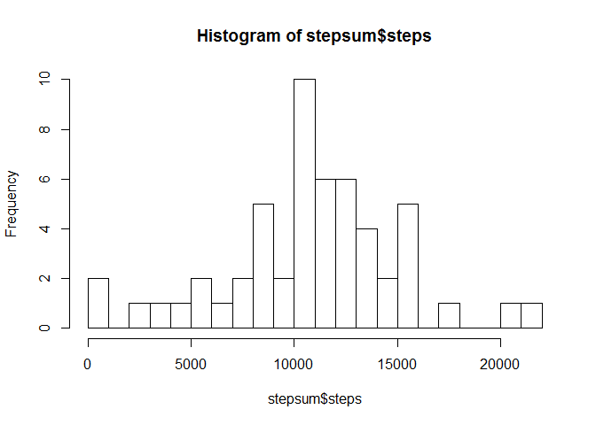
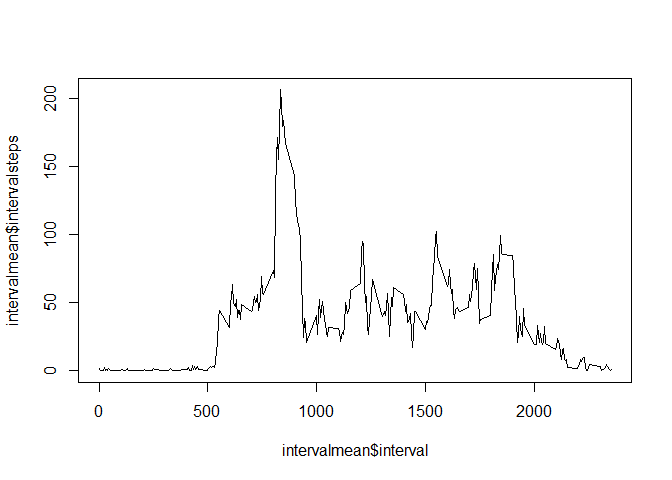
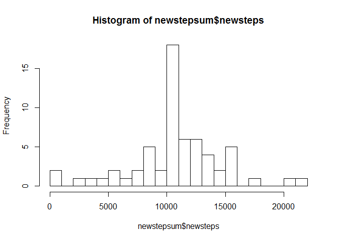
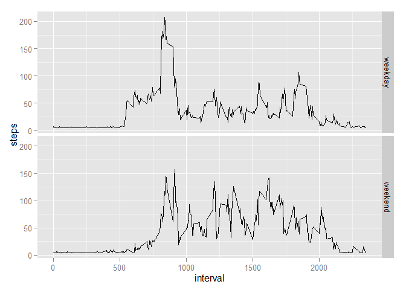

# Reproducible Research: Peer Assessment 1


## Loading and preprocessing the data

```r
setwd("~/R/activity")
data <- read.csv("activity.csv")
```

## What is mean total number of steps taken per day?
### 1) Calculate the total number of steps taken per day

```r
real <- complete.cases(data)
realdata <- data[real,]
date <- realdata[,2]
steps <- realdata[,1]
stepsum <- aggregate(steps ~ date, FUN = sum)
## The following is the list of total steps per day
print(stepsum)
```

```
##          date steps
## 1  2012-10-02   126
## 2  2012-10-03 11352
## 3  2012-10-04 12116
## 4  2012-10-05 13294
## 5  2012-10-06 15420
## 6  2012-10-07 11015
## 7  2012-10-09 12811
## 8  2012-10-10  9900
## 9  2012-10-11 10304
## 10 2012-10-12 17382
## 11 2012-10-13 12426
## 12 2012-10-14 15098
## 13 2012-10-15 10139
## 14 2012-10-16 15084
## 15 2012-10-17 13452
## 16 2012-10-18 10056
## 17 2012-10-19 11829
## 18 2012-10-20 10395
## 19 2012-10-21  8821
## 20 2012-10-22 13460
## 21 2012-10-23  8918
## 22 2012-10-24  8355
## 23 2012-10-25  2492
## 24 2012-10-26  6778
## 25 2012-10-27 10119
## 26 2012-10-28 11458
## 27 2012-10-29  5018
## 28 2012-10-30  9819
## 29 2012-10-31 15414
## 30 2012-11-02 10600
## 31 2012-11-03 10571
## 32 2012-11-05 10439
## 33 2012-11-06  8334
## 34 2012-11-07 12883
## 35 2012-11-08  3219
## 36 2012-11-11 12608
## 37 2012-11-12 10765
## 38 2012-11-13  7336
## 39 2012-11-15    41
## 40 2012-11-16  5441
## 41 2012-11-17 14339
## 42 2012-11-18 15110
## 43 2012-11-19  8841
## 44 2012-11-20  4472
## 45 2012-11-21 12787
## 46 2012-11-22 20427
## 47 2012-11-23 21194
## 48 2012-11-24 14478
## 49 2012-11-25 11834
## 50 2012-11-26 11162
## 51 2012-11-27 13646
## 52 2012-11-28 10183
## 53 2012-11-29  7047
```

### 2) If you do not understand the difference between a histogram and a barplot, research the difference between them. Make a histogram of the total number of steps taken each day

```r
hist(stepsum$steps, breaks = 20)
```

 

### 3) Calculate and report the mean and median of the total number of steps taken per day

```r
stepmean <- mean(stepsum$steps)
print(stepmean)
```

```
## [1] 10766.19
```

```r
stepmedian <- median(stepsum$steps)
print(stepmedian)
```

```
## [1] 10765
```

## What is the average daily activity pattern?
### 1) Make a time series plot (i.e. type = "l") of the 5-minute interval (x-axis) and the average number of steps taken, averaged across all days (y-axis)

```r
sortdata <- realdata[order(realdata$interval, realdata$date),]
interval <- sortdata[,3]
intervalsteps <- sortdata[,1]
intervalmean <- aggregate(intervalsteps ~ interval, FUN = mean)
plot(intervalmean$interval,intervalmean$intervalsteps, type="l")
```

 

### 2) Which 5-minute interval, on average across all the days in the dataset, contains the maximum number of steps?

```r
intervalwithmaxsteps <- intervalmean[which(grepl(max(intervalmean$intervalsteps), intervalmean$intervalsteps)),1]
print(intervalwithmaxsteps)
```

```
## [1] 835
```

## Inputing missing values
### 1) Calculate and report the total number of missing values in the dataset (i.e. the total number of rows with NAs)

```r
real <- complete.cases(data)
novalues <- length(real) - sum(real)
print(novalues)
```

```
## [1] 2304
```

### 2) Devise a strategy for filling in all of the missing values in the dataset. The strategy does not need to be sophisticated. For example, you could use the mean/median for that day, or the mean for that 5-minute interval, etc.

```r
## I am using the grand mean of average number of steps across all days over all intervals
nafiller <- mean(intervalmean$intervalsteps)
```

### 3) Create a new dataset that is equal to the original dataset but with the missing data filled in.

```r
newdata <- data
newdata[is.na(newdata)] <- nafiller
## This is how the data looks like after the fillers are put in
head(newdata)
```

```
##     steps       date interval
## 1 37.3826 2012-10-01        0
## 2 37.3826 2012-10-01        5
## 3 37.3826 2012-10-01       10
## 4 37.3826 2012-10-01       15
## 5 37.3826 2012-10-01       20
## 6 37.3826 2012-10-01       25
```

### 4) Make a histogram of the total number of steps taken each day and Calculate and report the mean and median total number of steps taken per day. Do these values differ from the estimates from the first part of the assignment? What is the impact of inputing missing data on the estimates of the total daily number of steps?

```r
newdate <- newdata[,2]
newsteps <- newdata[,1]
newstepsum <- aggregate(newsteps ~ newdate, FUN = sum)
hist(newstepsum$newsteps, breaks = 20)
```

 

```r
newstepmean <- mean(newstepsum$newsteps)
print(newstepmean)
```

```
## [1] 10766.19
```

```r
newstepmedian <- median(newstepsum$newsteps)
print(newstepmedian)
```

```
## [1] 10766.19
```

```r
## By inputting missing values with the average number of steps, the data becomes normal distribution, which means mean = median, as shown by the calculation in R
```

## Are there differences in activity patterns between weekdays and weekends?
### 1) Create a new factor variable in the dataset with two levels - "weekday" and "weekend" indicating whether a given date is a weekday or weekend day.

```r
newdata$date <- as.Date(newdata$date)
newday <- weekdays(newdata$date)
newdata$day <- newday

for(i in 1:length(newdata$day)) {
  if(newdata[i,4] == "Saturday" | newdata[i,4] == "Sunday") {
		newdata[i,4] <- "weekend"
	} else {
	newdata[i,4] <- "weekday"
	} 
}
## This is how the dataset looks like now
newdata[1435:1445,]
```

```
##      steps       date interval     day
## 1435     0 2012-10-05     2330 weekday
## 1436     0 2012-10-05     2335 weekday
## 1437     0 2012-10-05     2340 weekday
## 1438     0 2012-10-05     2345 weekday
## 1439     0 2012-10-05     2350 weekday
## 1440     0 2012-10-05     2355 weekday
## 1441     0 2012-10-06        0 weekend
## 1442     0 2012-10-06        5 weekend
## 1443     0 2012-10-06       10 weekend
## 1444     0 2012-10-06       15 weekend
## 1445     0 2012-10-06       20 weekend
```

### 2) Make a panel plot containing a time series plot (i.e. type = "l") of the 5-minute interval (x-axis) and the average number of steps taken, averaged across all weekday days or weekend days (y-axis). See the README file in the GitHub repository to see an example of what this plot should look like using simulated data.

```r
sortnewdata <- newdata[order(newdata$day, newdata$interval),]

weekday <- sortnewdata[sortnewdata$day == "weekday",]
steps <- weekday[,1]
interval <- weekday[,3]
weekdayavg <- aggregate(steps ~ interval, FUN = mean)
weekdayavg$day <- "weekday"
weekend <- sortnewdata[sortnewdata$day == "weekend",]
steps <- weekend[,1]
interval <- weekend[,3]
weekendavg <- aggregate(steps ~ interval, FUN = mean)
weekendavg$day <- "weekend"
stepsavg <- rbind(weekdayavg,weekendavg)

library(ggplot2)
```

```
## Warning: package 'ggplot2' was built under R version 3.1.3
```

```r
g <- ggplot(stepsavg, aes(interval, steps))
p <- g + geom_line() + facet_grid(day ~ .)
print(p)
```

 
